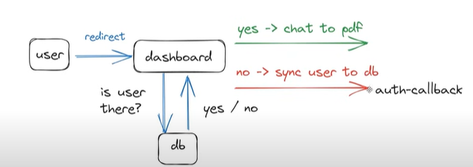

# PROCESS

- Landing Page
- Navigation
- Authorization and Authentication
- Functionality
- Payment Integration
- Add Live Support Paytm Handling
- Launch/Deployment Process

# First Time User

- User -(Login req)-> Kinde
- Kinde -(User New)-> HARTdraws <-> DB

then,

- Hartdraws -> Kinde -(Logged in, JWT)-> User

- Already User ?
  - Y -> chat to pdf
  - No -> Sync User to Db

# Dashboard

- my files
- upload pdf button
- list of files of user
- delete files icon per pdf

# tRPC

- helps ensuring data type is right which is very imp for Typescript
- Would have sent any incase of normal fetch
